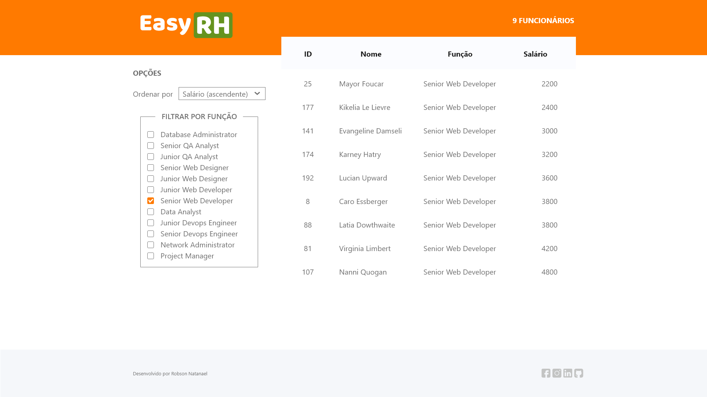

# Easy RH

<div aling="center" id="top">
  

  <p align="center">  
    
        
      
      
  </p>
  <p align="center">
    <a href="#sobre">Sobre</a> &#xa0; | &#xa0;
    <a href="#tecnologias">Tecnologias</a> &#xa0; | &#xa0;
    <a href="#pré-requisitos">Pré-requisitos</a> &#xa0; | &#xa0;
    <a href="#instalação">Instalação</a> &#xa0; | &#xa0;
    <a href="#licença">Licença</a> &#xa0; | &#xa0;
    <a href="https://github.com/robsonnatanael" target="_blank">Autor</a> &#xa0; | &#xa0;
  </p>
</div>

<h4 align="center"> 
	🚧  Em construção...  🚧
</h4>

## Sobre

O Easy RH é uma aplicação que possibilita gerenciar os dados dos funcionários de uma empresa, através de listagem de registros com ordenação e filtros configuráveis, das informações que são requisitadas ao Backend por meio de requisição http.

Projeto desenvolvido para obtenção de pontuação no Bootcamp de FrontEnd do IGTI.



## Tecnologias

Como pré-requisito foi utilizado apenas HTML, CSS e JavaScript na construção do projetos. Para fazer o redesign da UI sugerida, foi usado o Adobe XD e codificado no VS Code.

## Pré-requisitos

Você precisa ter o [Git](https://git-scm.com), [Node](https://nodejs.org/en/) e a [Live Server](https://www.npmjs.com/package/live-server) instalados em sua maquina.

## Instalação

```bash
# Clone este repositório
$ git clone https://github.com/robsonnatanael/EasyRH.git

# Para iniciar o backend entre no diretório EasyRH/backend
$ cd EasyRH/backend

# Instale as dependências
$ npm install

# Inicie o servidor
$ npm start

# Para iniciar o frontend entre no diretório EasyRH/frontend
$ cd EasyRH/frontend

# Iniciar o projeto
$ live-server

# O app vai inicializar em <http://localhost:8080>

```

## Licença

Este projeto está sob licença MIT. Veja o arquivo [LICENSE](LICENSE) para mais detalhes.

## Autor

<a href="https://www.robsonnatanael.com.br">
 
 <br />
 <sub><b>Robson Natanael</b></sub></a> <a href="https://www.robsonnatanael.com.br" title="Robson Natanael">🚀</a>

Feito com ❤️ por Robson Natanael 👋🏽 Entre em contato!

[](https://www.linkedin.com/in/robsonnatanael)
[](https://twitter.com/robsonnatanael)

---

<a href="#top">Voltar para o topo</a>
